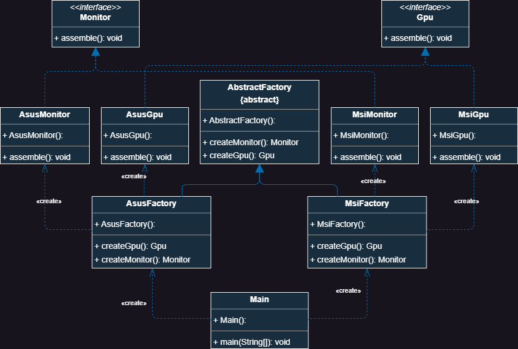

# Abstract Factory

## What is a Abstract Factory
> [!NOTE]
> Abstract Factory is a creational design pattern that lets you produce families of related objects without specifying their concrete classes.

Often design start by using the `Factory Method` which is less complicated than the `Abstract Factory` and evolve afterwards to the `Abstract Factory`.
`Abstract Factory` classes are therefore often based on a set of `Factory Methods`.

## General UML

## UML from the Code Example
