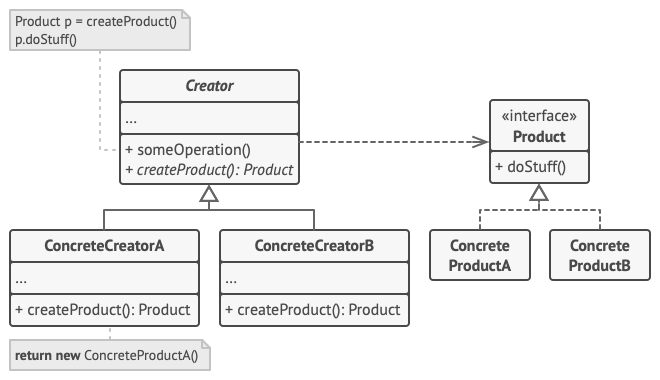

#  Factory Method

## What is the Factory Method
> [!NOTE]
> Factory Method is a creational design pattern that provides an interface for creating objects in a superclass, but allows subclasses to alter the type of objects that will be created.

## When to use the Factory Method
* When you don't know the exact types and dependencies of the objects your code works with.

## General UML

- The **Creator** class declares the factory method that returns new product objects. It’s important that the return type of this method matches the product interface.

- **Concrete Creators** override the base factory method so it returns a different type of product.

